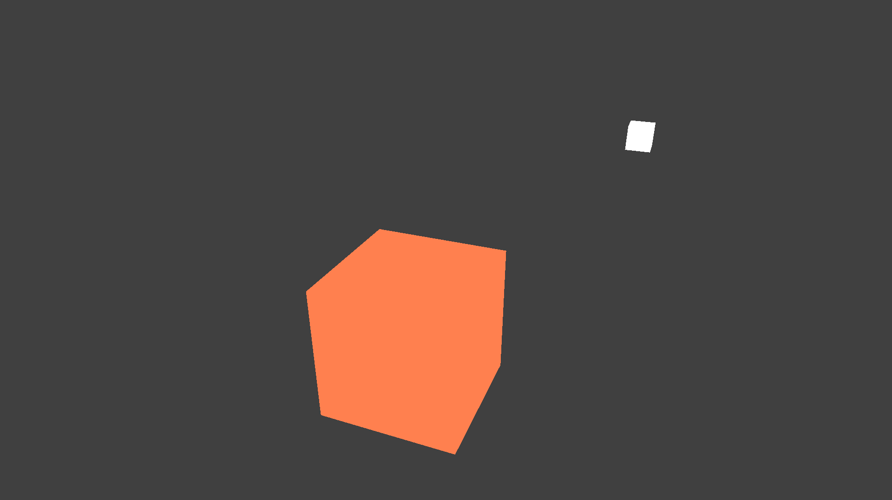

# Compilation

```
g++ -Wall -lglfw -ldl main.cpp ../include/glad.c shader.cpp camera.cpp && ./a.out
```

-lglfw: GLFW library

-ldl and glad.c: for GLAD

# Result



# Phong vs Gouraud lighting model (Модель Фонка против Гуро)

На заре графики разработчики вынуждены были обрабатывать модель освещения в вершинном шейдере, так как вершин намного меньше чем фрагментов (в фрагментном шейдере) то и сложных операций получалось делать меньше, такая модель освещения называется модель Гуро. Однако получая производительность мы теряем в реалистичности, модель Гуро менее реалистичная чем модель Фонга (которая просчитывает цвет для каждого фрагмента), поскольку мы считаем цвет только для вершин, а фрагменты между вершинами интерполируем.
