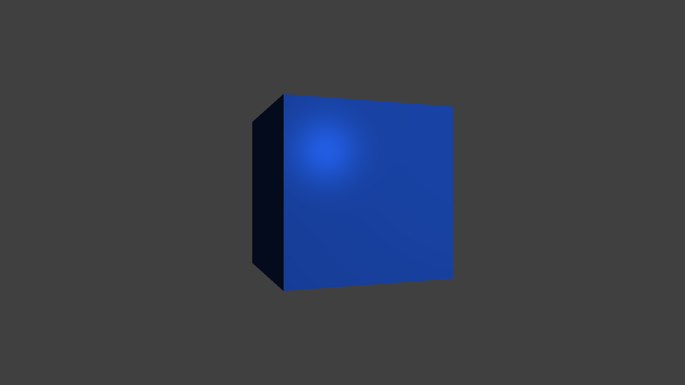
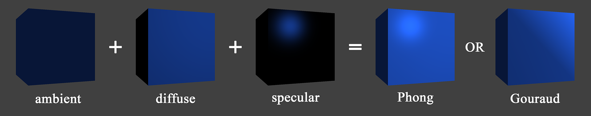
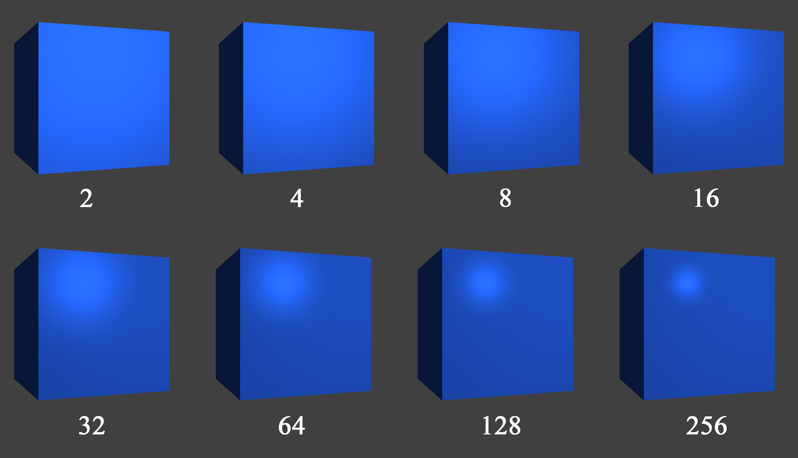

# Compilation

```
g++ -Wall -lglfw -ldl main.cpp ../include/glad.c shader.cpp camera.cpp && ./a.out
```

-lglfw: GLFW library

-ldl and glad.c: for GLAD

# Current result



___Material parameters:___ http://devernay.free.fr/cours/opengl/materials.html

# Phong vs Gouraud lighting model (Модель Фонга против Гуро)

На заре компьютерной графики разработчики вынуждены были обрабатывать модель освещения в вершинном шейдере. Так как вершин намного меньше чем фрагментов, то и сложных операций выходило меньше. Такая модель освещения называется __модель Гуро.__ Однако получая производительность мы теряем в реалистичности, в модели Гуро цвет просчитывается только для вершин, а значения цвета фрагментов между вершинами интерполируются. __Модель Фонга__ даёт более реалистичный результат, поскольку считает цвет для каждого фрагмента (теже самые вычисления но в фрагментном шейдере).



# Specular shininess


